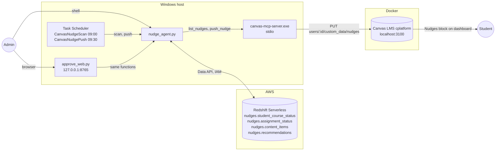
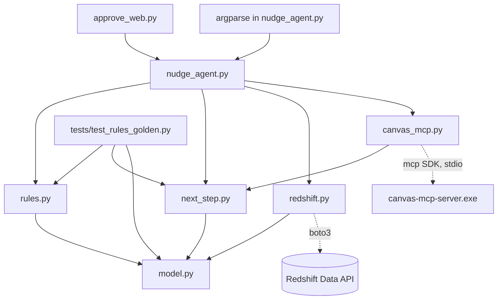
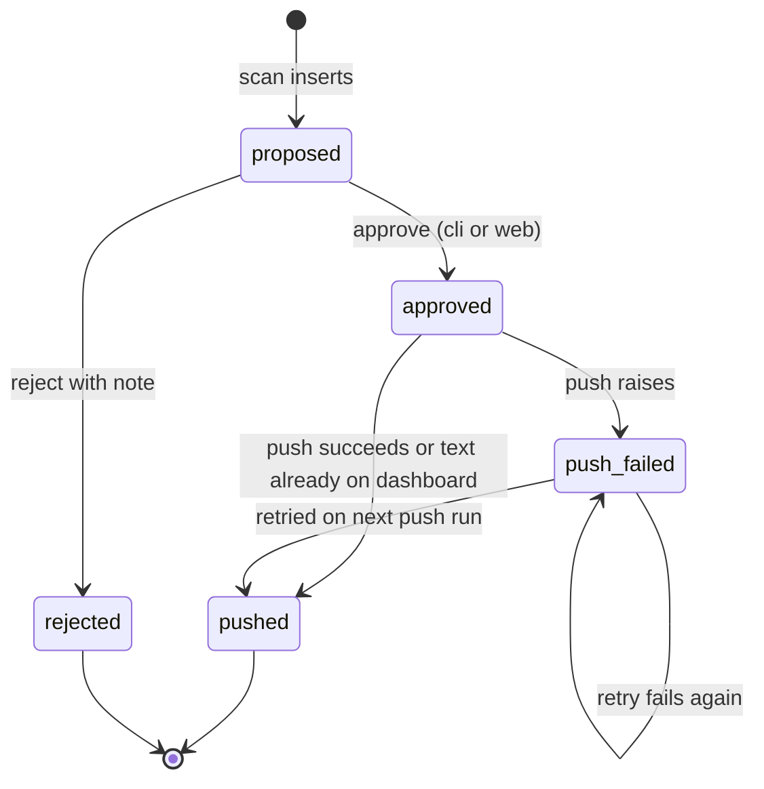
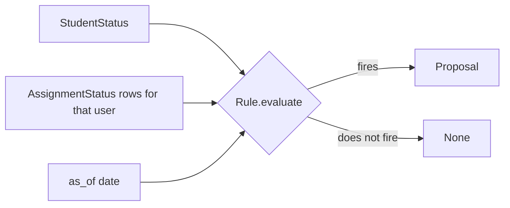
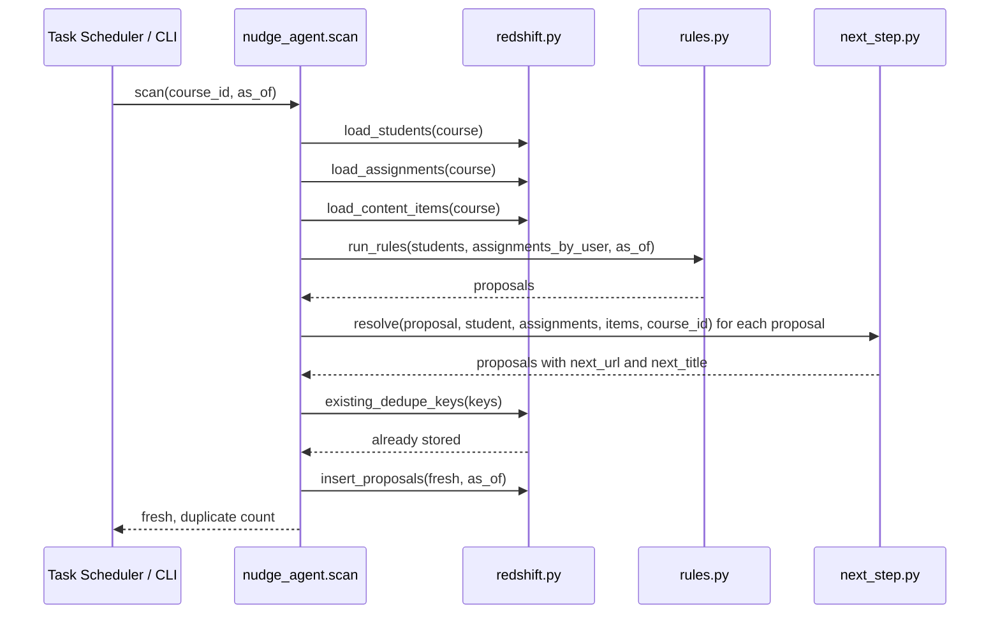
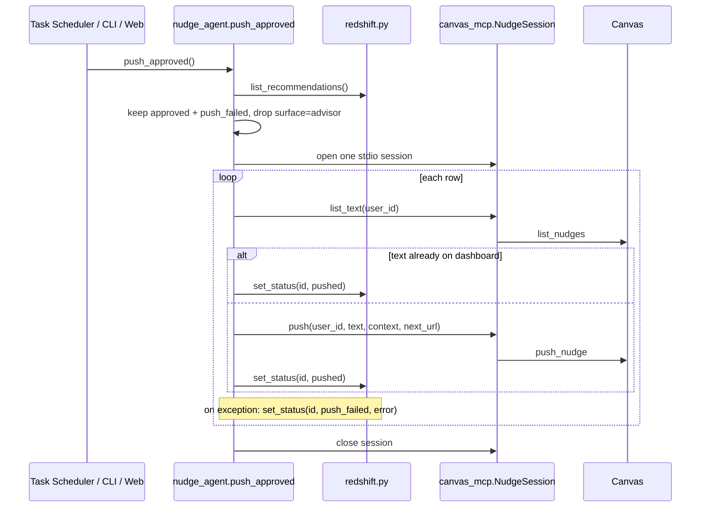

# Nudge Agent: Architecture and Design

Status: implemented and verified on 15 September 2026. Reads the tables described in the
`redshift` repository under `docs/ARCHITECTURE.md`.

## 1. Purpose

The agent turns a student status table in Redshift into nudges on the Canvas LMS dashboard,
with a human approval step between proposal and delivery. It runs on a schedule, proposes
deterministic messages from a rule registry, waits for an admin to approve or reject each one,
and pushes only approved rows to Canvas through the Canvas MCP server.

Three properties shaped every decision:

- **Nothing reaches a student without a human decision.** The push step reads only rows an
  admin has approved, and one rule class (advisor drafts) is never pushed at all.
- **Every operation can be rerun safely.** Scan, approve, and push each run twice with no
  duplicate side effects.
- **One table is the whole state.** The queue, the audit trail, and the retry list are three
  views of `nudges.recommendations`.

## 2. System context



The agent owns `recommendations` and reads the other three tables. It never writes to Canvas
directly; the MCP server is the only Canvas client, which keeps the agent free of Canvas API
details and lets the same server serve interactive sessions.

## 3. Module layout

```
nudge-agent/
  model.py            dataclasses, Status enum, TRANSITIONS, row coercion
  rules.py            Rule registry and pure evaluate functions
  next_step.py        next-step resolvers keyed by rule id, and the Canvas base URL
  redshift.py         Data API adapter: load, insert, list, set_status
  canvas_mcp.py       stdio MCP client session wrapping list_nudges and push_nudge
  nudge_agent.py      use cases (scan, approve, reject, push) and the CLI
  approve_web.py      HTTP approval page over the same use cases
  register_schedule.ps1
  tests/test_rules_golden.py
  tests/fixtures/content_items.csv
```



The dependency direction is strict. `model.py`, `rules.py` and `next_step.py` import nothing
from the adapters, so the rules and the resolver run in the golden test with no AWS credentials
and no Canvas. The two adapters (`redshift.py`, `canvas_mcp.py`) are the only modules that
touch the network. `nudge_agent.py` composes them into use cases, and both user interfaces call
those use cases rather than reimplementing them. `canvas_mcp.py` also reads `CANVAS_URL` from
`next_step.py`, so the base URL is defined once and the arrow still points from the adapter to
the pure module.

## 4. Domain model

### 4.1 Types

| Type | Source | Role |
|---|---|---|
| `StudentStatus` | one row of `student_course_status` | input to every rule |
| `AssignmentStatus` | one row of `assignment_status` | grouped by user, input to assignment rules |
| `Proposal` | output of a rule, then the resolver | what a rule wants to say and where it points, before it is stored |
| `Recommendation` | one row of `recommendations` | a stored proposal with next step, status and decision metadata |
| `ContentItem` | one row of `content_items` | the course's module items, input to the next-step resolver |
| `Status` | enum | `proposed`, `approved`, `rejected`, `pushed`, `push_failed` |

`Proposal` and `Recommendation` carry `next_url` and `next_title`, the one link the student
should click. Both are `None` when no resolver applies or its lookup finds nothing.
`ContentItem` mirrors the table column for column; its `topic_list` property splits the
comma-separated `topics` string.

All five dataclasses are frozen. `from_row` builds any of them from a Data API row dict,
coercing by the declared field type. This matters because the Data API returns DECIMAL and
TIMESTAMP columns as strings; the coercion is the one place that handles it.

### 4.2 Status state machine



`TRANSITIONS` in `model.py` is the single definition. `redshift.set_status` derives the legal
predecessor set from it and writes `WHERE id = ? AND status IN (...)`. The database therefore
refuses an illegal transition by updating zero rows, and the function returns `False`. No
caller needs its own "is this row still pending" check, and a race between the web page and
the CLI resolves to one winner.

### 4.3 Deduplication

`Proposal.dedupe_key(as_of)` is `rule|course_id|user_id|subject|date`. `subject` names what
the rule is about: the assignment ids for A1 and A2, the literal `inactive` for A3 and A4,
`quiz` for A5, `quiz_avg` for B3. Scan looks up the keys it is about to insert and drops any
that already exist, so a second scan on the same day inserts nothing and a new day proposes
again if the fact still holds. Redshift does not enforce uniqueness, so this check is the
whole guarantee.

## 5. Rule registry



Each entry in `RULES` is a frozen `Rule(id, tier, surface, priority, evaluate)`. `evaluate`
is a pure function of one student, that student's assignment rows, and the as-of date. It
returns a `Proposal` or `None`. Adding a rule is one function and one list entry; nothing in
the scan, approve, or push code changes.

| Rule | Fires when | Surface | Priority |
|---|---|---|---|
| A1 | any assignment with status `due_soon` | block | 4 |
| A2 | any assignment with status `missing` | block | 2 |
| A3 | 7 to 13 days inactive | inbox | 1 |
| A4 | 14 or more days inactive | advisor | 1 |
| A5 | at least one quiz in progress | block | 3 |
| B3 | quiz average below 60 percent, and not NULL | block | 3 |

`surface` is what makes A4 different without a special case: the push loop skips any row
whose surface is `advisor`. Approving an A4 row records the decision for the advisor and
nothing else happens. In this POC `inbox` rows are pushed to the dashboard because the MCP
server has no Inbox tool; the field is kept so a future Inbox path can branch on it.

Message text is deterministic and comes from the walkthrough document. There is no language
model call. A rewrite pass could sit between scan and approval later without touching the
approval or push steps.

### 5.1 The golden test

`tests/test_rules_golden.py` loads the two seed CSVs from the sibling `redshift` repository
and the twelve module items of course 1 from `tests/fixtures/content_items.csv`, runs the
registry as of 15 September 2026, and asserts that the set of users each rule fires for
equals the document's Day 0 table. Two further assertions pin exact message text. The rest
pin the resolved link for at least one proposal of every rule, that A4 has none, and that
every other proposal got one. The test needs no network, so it is the fastest check that a
rule edit did not change behaviour.

### 5.2 Next-step resolver

Every proposal carries one link, the next thing the student should click. `next_step.py`
resolves it from the course's module items after the rules have run. `RESOLVERS` is a dict
from rule id to a small function of the proposal, the student, that student's assignment
rows and the course's items, in the same shape as `RULES`. `resolve` looks the rule up and
applies the function. A rule with no entry passes through untouched, which is how A4
gets no link without a special case. A resolver whose lookup finds nothing leaves both
fields `None`.

| Rule | Next step |
|---|---|
| A1 | the Assignment item whose `content_id` is the first id in `reason["assignment_ids"]`. `rules.py` sorted those rows by due date, so it is the soonest |
| A2 | the same lookup on the first id. `rules.py` sorted the missing rows by due date, so it is the oldest |
| A3 | the earliest incomplete item by module and item position. Incomplete means an Assignment item the student has as `missing`, `due_soon` or `unsubmitted`. If there is none, the course home page |
| A4 | no link. An advisor draft is never pushed |
| A5 | the first Quiz item by module and item position |
| B3 | the first practice item whose topics include the student's weakest topic, or the first practice item when the student has no scored work |

Two of these are approximations, stated here so nobody mistakes them for the full design.

- A5 links the first quiz in the course, not the quiz the student left open. The seed carries
  a count of in-progress quizzes and no quiz id.
- B3 takes the topics of the student's lowest-scoring assignment as the weakest topic. A
  student with no scored row has none, so B3 falls back to the first practice item. Farah in
  the seed is that case. The proposal records which path fired in
  `reason["next_step_basis"]`, either `weakest_topic:<topic>` or `first_practice`.

## 6. Use cases

### 6.1 Scan



`as_of` defaults to today in America/New_York; the `--as-of` flag reproduces any day, which is
how the verification run reproduced Day 0 from a later date.

### 6.2 Approve and reject

Both are one `set_status` call. Approve takes a list of ids or `--all`; reject takes one id
and requires a note. `decided_by` records `cli` or `web`. Because `set_status` enforces the
state machine, approving an already-pushed row or rejecting an approved one updates nothing
and reports it.

### 6.3 Push



Two idempotence guards live here. The `list_nudges` check before every push covers a crash
between a successful Canvas write and the Redshift status update: on the next run the text is
found on the dashboard and the row is marked pushed without a second write. The `push_failed`
status keeps a failed row in the pending set so the next scheduled push retries it, and the
error text is stored on the row for the admin to read.

One MCP session is opened per push run, not per row, because spawning the server process
costs a few seconds.

## 7. Adapters

### 7.1 Redshift

`redshift.py` wraps the Data API with a polling `_execute` and a paging `run`. Reads use the
Data API's named parameters. Writes build SQL with a `quote` helper because the Data API does
not accept parameters inside `VALUES` lists for multi-row inserts; every value passes through
`quote`, which escapes single quotes and renders `None` as `NULL`. `reason` is written with
`JSON_PARSE` so it lands as SUPER.

### 7.2 Canvas MCP

`canvas_mcp.py` launches `canvas-mcp-server.exe` from the cmcp checkout as a stdio subprocess
with the Canvas URL and token in its environment, then speaks MCP over that pipe using the
official `mcp` client SDK. `NudgeSession` is an async context manager exposing two calls,
`list_text` and `push`. `push` takes the row's `next_url` and passes it as the tool's optional
`url` argument. When the url is empty the key is left out of the call rather than sent empty,
because an older server without the parameter would reject an unknown argument. The session
raises on an MCP error result so the push loop can mark the row failed. The MCP server is the
same one interactive Claude Code sessions use, so any fix to Canvas handling there applies to
the agent for free.

## 8. Interfaces

### 8.1 CLI

| Command | Effect |
|---|---|
| `scan [--course N] [--as-of DATE]` | run rules, resolve next steps, insert fresh proposals, print per-rule user lists |
| `queue` | table of proposed rows, with the linked title in a `next` column |
| `approve ID... \| --all` | mark proposed rows approved |
| `reject ID --note TEXT` | mark one proposed row rejected |
| `push` | push approved and retry failed rows |
| `status` | count of rows per status |

### 8.2 Web approval page

A single stdlib `ThreadingHTTPServer` bound to 127.0.0.1. `GET /` renders two tables:
proposed rows with Approve and Reject forms, and history rows (approved, pushed, failed,
rejected) with decider, time, note, and any push error. Both tables show the next title as a
link. Four `POST` routes (`/approve/ID`, `/reject/ID`, `/approve-all`, `/push`) call the same
functions the CLI uses and redirect back to `/` with a 303, so a browser refresh never repeats
an action. There is no session, no authentication, and no JavaScript; localhost binding is the
access control for a POC. Each render issues two Data API queries, so a page load takes a few
seconds.

### 8.3 Schedule

`register_schedule.ps1` registers two daily Windows Task Scheduler jobs that `cd` into the
project and run `uv run nudge_agent.py scan` at 09:00 and `push` at 09:30, appending to
`logs/scan.log` and `logs/push.log`. The gap gives an admin half an hour to approve. `-DryRun`
prints the two `schtasks` commands without registering. Scheduling stays on the host because
Canvas runs on localhost; when Canvas is hosted, EventBridge Scheduler or a cron container can
run the same two commands.

## 9. Verification record

Run on 15 September 2026 against the live Redshift workgroup and Canvas instance.

| Check | Result |
|---|---|
| `uv run pytest -q` | 12 passed |
| resolved links pinned by the golden test (seed ids) | A1 user 4 Word Problems Set, A2 user 5 Grammar Rules Drill 1, A2 user 3 Linear Equations Set, A3 user 5 Grammar Rules Drill 1, A5 user 4 Reading Checkpoint Quiz, B3 user 7 Reading Practice Set with basis `first_practice`; A4 user 6 has no link |
| `scan --as-of 2026-09-15` | A1 [4,5,6,9,11,12], A2 [3,5,6,11], A3 [5], A4 [6], A5 [4,11], B3 [8]; 15 inserted. Equals the document's Day 0 sets after the id map |
| second identical scan | 0 inserted, 15 skipped as duplicate |
| approve one A1 row for user 6 on the web page | row shown as approved by `web` |
| `push` | pushed 1, already present 0, failed 0, skipped advisor 0 |
| `list_nudges` for user 6 through cmcp | count went from 5 to 6, new text present once |
| second `push` | pushed 0, count unchanged |
| `schtasks /Run` both tasks | logs show the same summaries as the manual runs |

## 10. Limits and future work

- **Rules the seed cannot compute.** A6, A7, B1, B2, B4, B5 need event history or per-item
  module completion that the seed tables do not carry. The registry is ready for them once
  the streaming feed lands.
- **Inbox cap.** The document's limit of one Inbox message per student per three days is not
  implemented, because no Inbox send exists in this POC.
- **Push is sequential.** One student at a time over one MCP session. Fine for tens of rows;
  batch the `list_nudges` calls before parallelising the pushes if it grows.
- **Approval page has no login.** Bind it behind a reverse proxy with authentication before
  exposing it beyond localhost.
- **Text is fixed per rule.** A language model rewrite for tone would slot in after scan and
  before approval, storing its output in `text` and its input in `reason`, so the approval and
  push steps stay unchanged.
