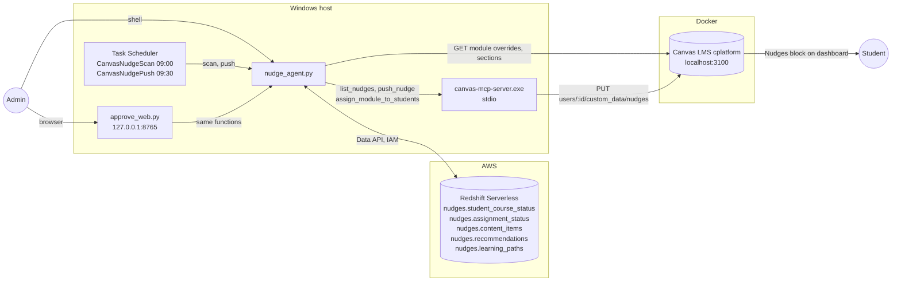
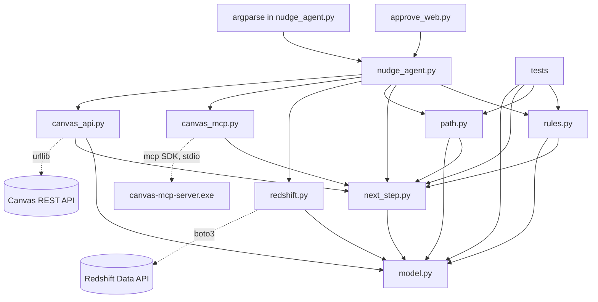
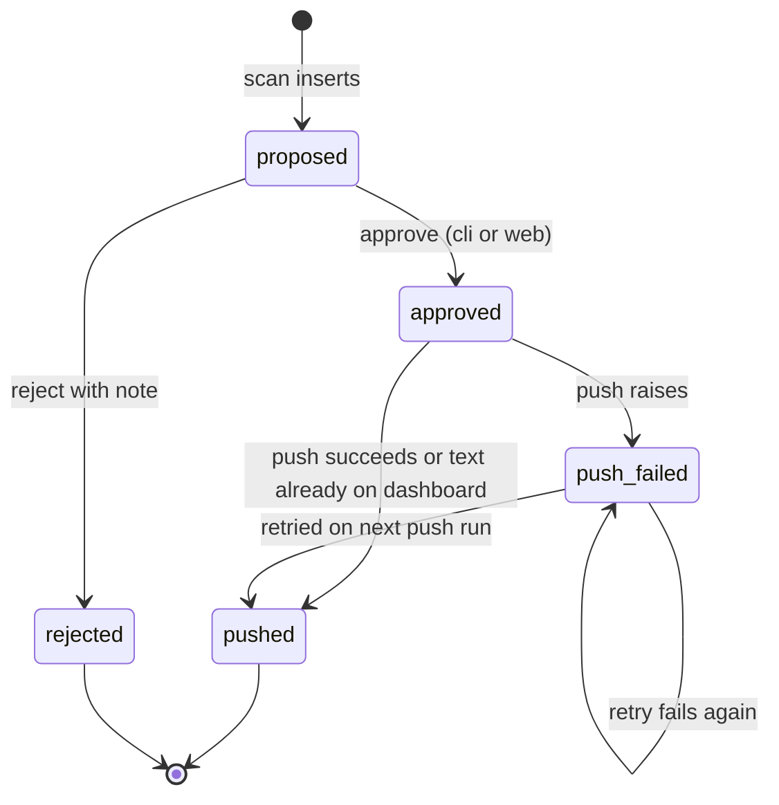
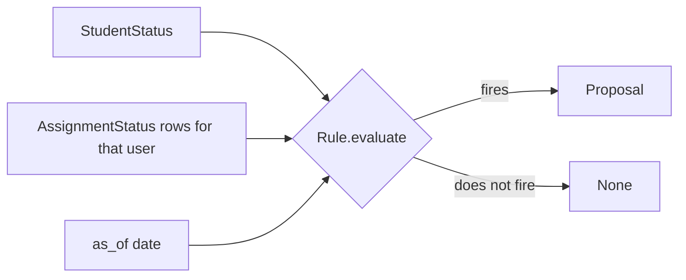
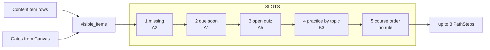
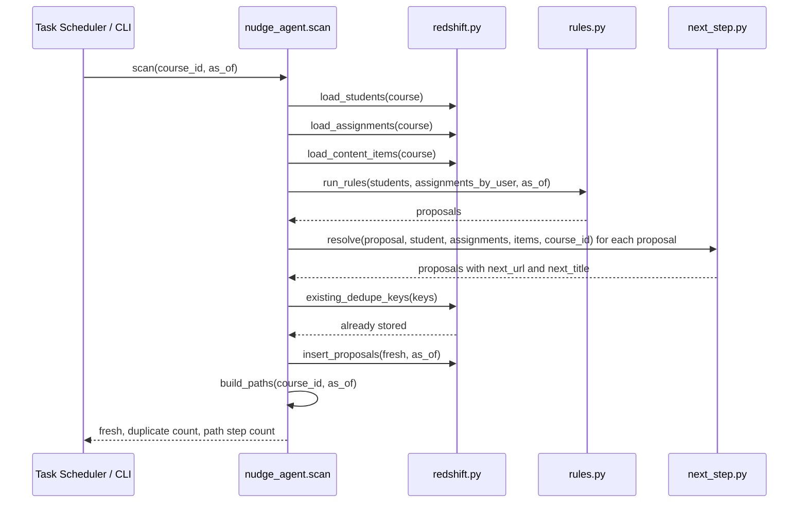
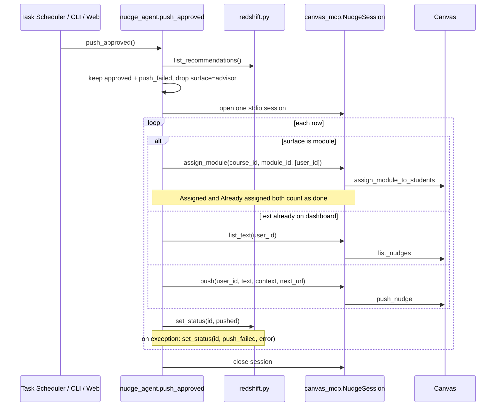

# Nudge Agent: Architecture and Design

Status: implemented and verified on 15 September 2026. Reads the tables described in the
`redshift` repository under `docs/ARCHITECTURE.md`.

## 1. Purpose

The agent turns a student status table in Redshift into nudges on the Canvas LMS dashboard,
with a human approval step between proposal and delivery. It runs on a schedule, proposes
deterministic messages from a rule registry, waits for an admin to approve or reject each one,
and pushes only approved rows to Canvas through the Canvas MCP server.

Three properties shaped every decision:

- **Nothing reaches a student without a human decision.** The push step reads only rows an
  admin has approved, and one rule class (advisor drafts) is never pushed at all.
- **Every operation can be rerun safely.** Scan, approve, and push each run twice with no
  duplicate side effects.
- **One table is the whole state.** The queue, the audit trail, and the retry list are three
  views of `nudges.recommendations`.

## 2. System context



The agent owns `recommendations` and `learning_paths` and reads the other three tables. It
never writes to Canvas directly; the MCP server is the only Canvas client, which keeps the agent
free of Canvas API details and lets the same server serve interactive sessions. The one Canvas
call the agent makes for itself is a read of module overrides, because module visibility is an
input to the path builder rather than an action on a student.

## 3. Module layout

```
nudge-agent/
  model.py            dataclasses, Status enum, TRANSITIONS, row coercion
  rules.py            Rule registry and pure evaluate functions
  next_step.py        next-step resolvers keyed by rule id, topic helpers, the Canvas base URL
  path.py             learning path builder, five ordered slots over the visible items
  redshift.py         Data API adapter: load, insert, list, set_status, replace_paths
  canvas_mcp.py       stdio MCP client session wrapping the three Canvas tools
  canvas_api.py       read-only Canvas HTTP adapter, module overrides and section members
  nudge_agent.py      use cases (scan, build_paths, approve, reject, push) and the CLI
  approve_web.py      HTTP approval page over the same use cases
  register_schedule.ps1
  tests/conftest.py   seed and fixture loaders shared by both test modules
  tests/test_rules_golden.py
  tests/test_path.py
  tests/fixtures/content_items.csv
```



The dependency direction is strict. `model.py`, `rules.py`, `next_step.py` and `path.py` import
nothing from the adapters, so the rules, the resolver and the path builder all run in the tests
with no AWS credentials and no Canvas. The three adapters (`redshift.py`, `canvas_mcp.py`,
`canvas_api.py`) are the only modules that touch the network. `nudge_agent.py` composes them
into use cases, and both user interfaces call those use cases rather than reimplementing them.
Both Canvas adapters read `CANVAS_URL` from `next_step.py`, so the base URL is defined once and
the arrows still point from an adapter to a pure module.

Among the pure modules `next_step.py` is the one that answers questions about the course
catalogue, so `rules.py` and `path.py` both import `topic_need` and `remediation_modules` from
it. Neither is imported back, so there is no cycle.

## 4. Domain model

### 4.1 Types

| Type | Source | Role |
|---|---|---|
| `StudentStatus` | one row of `student_course_status` | input to every rule |
| `AssignmentStatus` | one row of `assignment_status` | grouped by user, input to assignment rules |
| `Proposal` | output of a rule, then the resolver | what a rule wants to say and where it points, before it is stored |
| `Recommendation` | one row of `recommendations` | a stored proposal with next step, status and decision metadata |
| `ContentItem` | one row of `content_items` | the course's module items, input to the next-step resolver and the path builder |
| `PathStep` | one row of `learning_paths` | one position in a student's ordered to-do list |
| `Gates` | alias for `dict[int, set[int]]` | module id to the user ids Canvas will show that module to |
| `Status` | enum | `proposed`, `approved`, `rejected`, `pushed`, `push_failed` |

`Proposal` and `Recommendation` carry `next_url` and `next_title`, the one link the student
should click. Both are `None` when no resolver applies or its lookup finds nothing.
`ContentItem` mirrors the table column for column; its `topic_list` property splits the
comma-separated `topics` string.

`PathStep` carries its `position`, the module item it points at, the `reason` the student is
being sent there, and the `source_rule` whose logic chose it. `source_rule` is `None` for a step
that is only the next thing in the course.

`Gates` is a plain alias rather than a class because absence is the interesting case. A module
id missing from the dict is open to every student, a module id present is visible only to the
ids in its set, and a module mapped to the empty set is visible to nobody. Canvas override
semantics fall out of one dict lookup with no branching, and `path.visible_items` is the single
line that reads it.

All six dataclasses are frozen. `from_row` builds any of them from a Data API row dict,
coercing by the declared field type. This matters because the Data API returns DECIMAL and
TIMESTAMP columns as strings; the coercion is the one place that handles it.

### 4.2 Status state machine



`TRANSITIONS` in `model.py` is the single definition. `redshift.set_status` derives the legal
predecessor set from it and writes `WHERE id = ? AND status IN (...)`. The database therefore
refuses an illegal transition by updating zero rows, and the function returns `False`. No
caller needs its own "is this row still pending" check, and a race between the web page and
the CLI resolves to one winner.

### 4.3 Deduplication

`Proposal.dedupe_key(as_of)` is `rule|course_id|user_id|subject|date`. `subject` names what
the rule is about: the assignment ids for A1 and A2, the literal `inactive` for A3 and A4,
`quiz` for A5, `quiz_avg` for B3, and `module:<module_id>` for R1. Scan looks up the keys it is
about to insert and drops any that already exist, so a second scan on the same day inserts nothing and a new day proposes
again if the fact still holds. Redshift does not enforce uniqueness, so this check is the
whole guarantee.

## 5. Rule registry



Each entry in `RULES` is a frozen `Rule(id, tier, surface, priority, evaluate)`. `evaluate`
is a pure function of one student, that student's assignment rows, and the as-of date. It
returns a `Proposal` or `None`. Adding a rule is one function and one list entry; nothing in
the scan, approve, or push code changes.

| Rule | Fires when | Surface | Priority |
|---|---|---|---|
| A1 | any assignment with status `due_soon` | block | 4 |
| A2 | any assignment with status `missing` | block | 2 |
| A3 | 7 to 13 days inactive | inbox | 1 |
| A4 | 14 or more days inactive | advisor | 1 |
| A5 | at least one quiz in progress | block | 3 |
| B3 | quiz average below 60 percent, and not NULL | block | 3 |
| R1 | medium or high risk, or a quiz average under 60 percent, and a remediation module whose topic the student needs | module | 2 |

`tier` records where a rule's inputs come from. An `A` rule is fed by student events and a `B`
rule is swept from aggregates. R1 is neither, so it carries its own tier `R`. It reads the module
catalogue, asks which remedial modules exist and which topics they cover, and proposes assigning
one. Nothing about it is driven by an event or a nightly aggregate, and calling it A or B would
misdescribe when it needs to run.

Every evaluator takes the course's `ContentItem` rows alongside the student and the assignment
rows. The six original rules ignore the argument. R1 needs it, and giving it to all seven keeps
one signature in the registry rather than a second kind of rule.

An evaluator returns a list of proposals rather than one or none, because R1 fires once per
remediation module and a course may carry several.

`surface` is what makes A4 different without a special case: the push loop skips any row
whose surface is `advisor`. The same field is what makes R1 different. A `module` row is pushed
by assigning a Canvas module override instead of writing a dashboard nudge, and the push step
reads the surface to choose. Adding the surface changed one dispatch function. The queue, the
approval page, the dedupe key, and the state machine all carry a `module` row unaltered. Approving an A4 row records the decision for the advisor and
nothing else happens. In this POC `inbox` rows are pushed to the dashboard because the MCP
server has no Inbox tool; the field is kept so a future Inbox path can branch on it.

Message text is deterministic and comes from the walkthrough document. There is no language
model call. A rewrite pass could sit between scan and approval later without touching the
approval or push steps.

### 5.1 The golden test

`tests/conftest.py` loads the two seed CSVs from the sibling `redshift` repository and the
fourteen module items of course 1 from `tests/fixtures/content_items.csv`, and hands them to
both test modules as session fixtures.

`tests/test_rules_golden.py` runs the registry as of 15 September 2026 and asserts that the set
of users each rule fires for equals the document's Day 0 table, now with R1 for users 5, 6 and
10. Two further assertions pin exact message text. The rest pin the resolved link for at least
one proposal of every linking rule, and that A4 and R1 carry none. A4 has no link because an
advisor draft is never pushed, R1 because a module assignment is not a link the student clicks.

`tests/test_path.py` pins the path builder against the same fixtures, with module 4 gated shut
and then assigned to Elena, so the ordering of the five slots and the effect of a gate are both
covered. Neither test needs the network, so together they are the fastest check that an edit did
not change behaviour.

### 5.2 Next-step resolver

Every proposal carries one link, the next thing the student should click. `next_step.py`
resolves it from the course's module items after the rules have run. `RESOLVERS` is a dict
from rule id to a small function of the proposal, the student, that student's assignment
rows and the course's items, in the same shape as `RULES`. `resolve` looks the rule up and
applies the function. A rule with no entry passes through untouched, which is how A4
gets no link without a special case. A resolver whose lookup finds nothing leaves both
fields `None`.

| Rule | Next step |
|---|---|
| A1 | the Assignment item whose `content_id` is the first id in `reason["assignment_ids"]`. `rules.py` sorted those rows by due date, so it is the soonest |
| A2 | the same lookup on the first id. `rules.py` sorted the missing rows by due date, so it is the oldest |
| A3 | the earliest incomplete item by module and item position. Incomplete means an Assignment item the student has as `missing`, `due_soon` or `unsubmitted`. If there is none, the course home page |
| A4 | no link. An advisor draft is never pushed |
| A5 | the first Quiz item by module and item position |
| B3 | the first practice item whose topics include the student's weakest topic, or the first practice item when the student has no scored work |

Two of these are approximations, stated here so nobody mistakes them for the full design.

- A5 links the first quiz in the course, not the quiz the student left open. The seed carries
  a count of in-progress quizzes and no quiz id.
- B3 takes the topics of the student's lowest-scoring assignment as the weakest topic. A
  student with no scored row has none, so B3 falls back to the first practice item. Farah in
  the seed is that case. The proposal records which path fired in
  `reason["next_step_basis"]`, either `weakest_topic:<topic>` or `first_practice`.

### 5.3 Path builder

`path.py` turns the same three inputs into an ordered to-do list. It is pure, like the rules, and
writes a `PathStep` per position.



Gating runs first, so a student is never pointed at a module Canvas will not show them. Then
`SLOTS`, a list of five generators, fills positions in order. The first slot that offers an item
wins its position, an item already placed is skipped when a later slot offers it again, and the
build stops at the cap.

| Slot | Items it offers | Reason written on the step | `source_rule` |
|---|---|---|---|
| 1 | assignments the student is missing, oldest due first | `missing` | A2 |
| 2 | assignments due soon, soonest first | `due tomorrow`, `due today`, `due in N days` | A1 |
| 3 | the first Quiz in the course, only while a quiz is in progress | `quiz in progress` | A5 |
| 4 | practice items whose topics meet a topic the student needs | `practice: <topic>` | B3 |
| 5 | every item left, in module then item order | `next in course order` | none |

`source_rule` names the rule whose logic the slot borrows, not a proposal. A path is built for
every student on every scan, whether or not any rule fired for them, so the two are independent.
Slot 5 has no rule behind it and writes `None`.

Slot 4 orders remediation modules ahead of the ordinary practice items. A student only sees a
remediation module at all once an educator has approved an R1 row and the push assigned it, so
its presence in the path is the most deliberate signal in the catalogue for that student. This is
also why the same practice page can appear in two modules without duplicating a step. Placement
is keyed on item type and title, so the gated-in copy in the remediation module takes the
position and the ordinary copy is skipped.

Slot 5 skips assignments the student has already submitted or had graded. The seed carries only
rows a rule fires on, so no assignment row has either status today and the filter removes
nothing; it is there for a feed that carries the full roster.

Two rules end the build early. A student whose `module_requirement_completed` has reached
`module_requirement_count` gets an empty path, which is Ava in the seed. Everyone else stops at
`CAP`, which is 8 because the path is a to-do list on a dashboard, not a syllabus. A student who
has to scroll it has been handed a backlog rather than a next step.

`replace_paths` writes the result. It deletes the whole course and reinserts it inside one
`batch_execute_statement`, so the table is never half-rebuilt and a rerun needs no dedupe key.
The path is derived state, recomputed from scratch every run, which is what makes that safe. This
is the opposite choice from `recommendations`, where a row is an audit record with a human
decision attached and nothing is ever deleted.

## 6. Use cases

### 6.1 Scan



`build_paths` is also a use case of its own behind the `path` command. It loads the same three
tables, reads the gates from Canvas, builds a path per student, replaces the course's rows, and
returns a count per student. `scan` calls it last, after the proposals are inserted, so a failure
reaching Canvas cannot cost the run its proposals.

`as_of` defaults to today in America/New_York; the `--as-of` flag reproduces any day, which is
how the verification run reproduced Day 0 from a later date.

### 6.2 Approve and reject

Both are one `set_status` call. Approve takes a list of ids or `--all`; reject takes one id
and requires a note. `decided_by` records `cli` or `web`. Because `set_status` enforces the
state machine, approving an already-pushed row or rejecting an approved one updates nothing
and reports it.

### 6.3 Push



Two idempotence guards live here. The `list_nudges` check before every push covers a crash
between a successful Canvas write and the Redshift status update: on the next run the text is
found on the dashboard and the row is marked pushed without a second write. The `push_failed`
status keeps a failed row in the pending set so the next scheduled push retries it, and the
error text is stored on the row for the admin to read.

A `module` row takes the first branch. `_push_row` reads `reason.module_id` and calls
`assign_module_to_students`, which adds the student to the module's Canvas override. `reason` is
stored as SUPER and comes back from the Data API as a JSON string, so the push step parses it
once at that point; nothing else in the agent reads inside a stored reason. The tool is additive
and idempotent, and both of its answers mean the student is covered, so a reply starting
`Assigned` or `Already assigned` marks the row pushed. Any other reply is treated as a failure
and the row keeps its error for the next run. This gives the module surface the same crash
tolerance the `list_nudges` check gives the dashboard surface, and from the same source, the tool
being safe to call twice.

`_push_row` returns the name of the tally bucket it filled, so the loop marks the row and counts
it without knowing which surface it handled. The tally gained `modules_assigned` and nothing else
in the loop changed.

One MCP session is opened per push run, not per row, because spawning the server process
costs a few seconds.

## 7. Adapters

### 7.1 Redshift

`redshift.py` wraps the Data API with a polling `_execute` and a paging `run`. Reads use the
Data API's named parameters. Writes build SQL with a `quote` helper because the Data API does
not accept parameters inside `VALUES` lists for multi-row inserts; every value passes through
`quote`, which escapes single quotes and renders `None` as `NULL`. `reason` is written with
`JSON_PARSE` so it lands as SUPER.

`replace_paths` is the one write that does not go through `_execute`. It sends a `DELETE` and a
multi-row `INSERT` as a two-element `Sqls` list to `batch_execute_statement`, so the rebuild is
one statement to wait on and the table is never observed emptied. When a course has no steps to
write the batch is the `DELETE` alone. The insert's column list is built from `PathStep`'s own
fields, and so are the values, so the two cannot drift apart when the dataclass gains a field.

### 7.2 Canvas MCP

`canvas_mcp.py` launches `canvas-mcp-server.exe` from the cmcp checkout as a stdio subprocess
with the Canvas URL and token in its environment, then speaks MCP over that pipe using the
official `mcp` client SDK. `NudgeSession` is an async context manager exposing three calls,
`list_text`, `push` and `assign_module`. `push` takes the row's `next_url` and passes it as the tool's optional
`url` argument. When the url is empty the key is left out of the call rather than sent empty,
because an older server without the parameter would reject an unknown argument. The session
raises on an MCP error result so the push loop can mark the row failed. The MCP server is the
same one interactive Claude Code sessions use, so any fix to Canvas handling there applies to
the agent for free.

### 7.3 Canvas read API

`canvas_api.py` is the one place the agent talks to Canvas without the MCP server. It is
read-only, it uses `urllib` from the standard library rather than a dependency, and it answers a
single question: which students can see which modules.

Canvas expresses that through assignment overrides on the module. A module carrying no override
is open to the whole course. A module carrying any override is visible only to the students its
overrides name, either individually on an ADHOC override or through a section. `module_gates`
fetches the overrides for each module id, skips the modules that have none so they stay absent
from the `Gates` dict, and unions the named students with the members of any section an override
points at. Section membership costs one more request, so it is fetched lazily and at most once
per call, and only when some override actually names a section.

The read lives outside the MCP server on purpose. Everything the agent sends through MCP changes
a student's experience and passes an approval gate first. This is an input to a computation, it
runs on every scan with no human in the loop, and treating it as an ordinary HTTP read keeps that
distinction visible in the module layout. `CANVAS_TOKEN` overrides the default dev token, and it
is read per request so a caller can set it after import.

Module 4 in the seed course is the interesting case. It carries a section override on an empty
section, so it maps to the empty set and no student's path shows it. Pushing an approved R1 row
adds that student to the override, and the next `path` run puts the module's two items at the
front of their practice slot. The rule proposes, the human approves, the push changes Canvas, and
the path reads Canvas back. No state about who is assigned lives in the agent.

## 8. Interfaces

### 8.1 CLI

| Command | Effect |
|---|---|
| `scan [--course N] [--as-of DATE]` | run rules, resolve next steps, insert fresh proposals, rebuild the paths, print per-rule user lists and the path total |
| `path [--course N] [--as-of DATE]` | rebuild every student's path and print a row per student plus a total |
| `queue` | table of proposed rows, with the linked title in a `next` column |
| `approve ID... \| --all` | mark proposed rows approved |
| `reject ID --note TEXT` | mark one proposed row rejected |
| `push` | push approved and retry failed rows, assigning modules for `module` rows |
| `status` | count of rows per status |

### 8.2 Web approval page

A single stdlib `ThreadingHTTPServer` bound to 127.0.0.1. `GET /` renders two tables:
proposed rows with Approve and Reject forms, and history rows (approved, pushed, failed,
rejected) with decider, time, note, and any push error. Both tables show the next title as a
link. Four `POST` routes (`/approve/ID`, `/reject/ID`, `/approve-all`, `/push`) call the same
functions the CLI uses and redirect back to `/` with a 303, so a browser refresh never repeats
an action. There is no session, no authentication, and no JavaScript; localhost binding is the
access control for a POC. Each render issues two Data API queries, so a page load takes a few
seconds.

### 8.3 Schedule

`register_schedule.ps1` registers two daily Windows Task Scheduler jobs that `cd` into the
project and run `uv run nudge_agent.py scan` at 09:00 and `push` at 09:30, appending to
`logs/scan.log` and `logs/push.log`. The gap gives an admin half an hour to approve. `-DryRun`
prints the two `schtasks` commands without registering. Scheduling stays on the host because
Canvas runs on localhost; when Canvas is hosted, EventBridge Scheduler or a cron container can
run the same two commands.

## 9. Verification record

Run on 15 September 2026 against the live Redshift workgroup and Canvas instance.

Rows marked offline are computed from the seed CSVs and the item fixture with no network. The
rest ran against the workgroup and the Canvas container.

| Check | Result |
|---|---|
| `uv run pytest -q` | 20 passed |
| Elena's path at 2026-09-15, offline | module 4 gated shut, eight steps: Reading Diagnostic, Grammar Rules Drill 1 and Linear Equations Set as `missing`, Word Problems Set `due tomorrow`, Practice Test 1 Reflection `due in 2 days`, then Reading Practice Set, Grammar Practice Set and item 11 Algebra Refresher as practice. With module 4 assigned to her, positions 6 and 7 become items 13 and 14 and position 8 is Reading Practice Set; item 11 drops out because the gated-in copy already took the title |
| R1 firings at 2026-09-15, offline | users 5, 6 and 10, each with basis `missing:Linear Equations Set`. Ben has the same missing item but is low risk on a 67 percent average, and Farah has a 50 percent average but no assignment rows to name a topic |
| resolved links pinned by the golden test (seed ids) | A1 user 4 Word Problems Set, A2 user 5 Grammar Rules Drill 1, A2 user 3 Linear Equations Set, A3 user 5 Grammar Rules Drill 1, A5 user 4 Reading Checkpoint Quiz, B3 user 7 Reading Practice Set with basis `first_practice`; A4 user 6 has no link |
| `scan --as-of 2026-09-15` | A1 [4,5,6,9,11,12], A2 [3,5,6,11], A3 [5], A4 [6], A5 [4,11], B3 [8]; 15 inserted. Equals the document's Day 0 sets after the id map |
| second identical scan | 0 inserted, 15 skipped as duplicate |
| approve one A1 row for user 6 on the web page | row shown as approved by `web` |
| `push` | pushed 1, already present 0, failed 0, skipped advisor 0 |
| `list_nudges` for user 6 through cmcp | count went from 5 to 6, new text present once |
| second `push` | pushed 0, count unchanged |
| `schtasks /Run` both tasks | logs show the same summaries as the manual runs |

## 10. Limits and future work

- **Rules the seed cannot compute.** A6, A7, B1, B2, B4, B5 need event history or per-item
  module completion that the seed tables do not carry. The registry is ready for them once
  the streaming feed lands.
- **Inbox cap.** The document's limit of one Inbox message per student per three days is not
  implemented, because no Inbox send exists in this POC.
- **Canvas reads are unpaginated.** `canvas_api` requests the overrides and sections endpoints
  once each and reads the first page. A course with more than a hundred sections would be
  truncated. Add `per_page` and `Link` traversal before a real roster.
- **Gates are fetched per scan, for every module.** One request per module in the course, plus at
  most one for sections. Fine for four modules; cache it or read the whole course's overrides in
  one call if a course grows.
- **Push is sequential.** One student at a time over one MCP session. Fine for tens of rows;
  batch the `list_nudges` calls before parallelising the pushes if it grows.
- **Approval page has no login.** Bind it behind a reverse proxy with authentication before
  exposing it beyond localhost.
- **Text is fixed per rule.** A language model rewrite for tone would slot in after scan and
  before approval, storing its output in `text` and its input in `reason`, so the approval and
  push steps stay unchanged.
